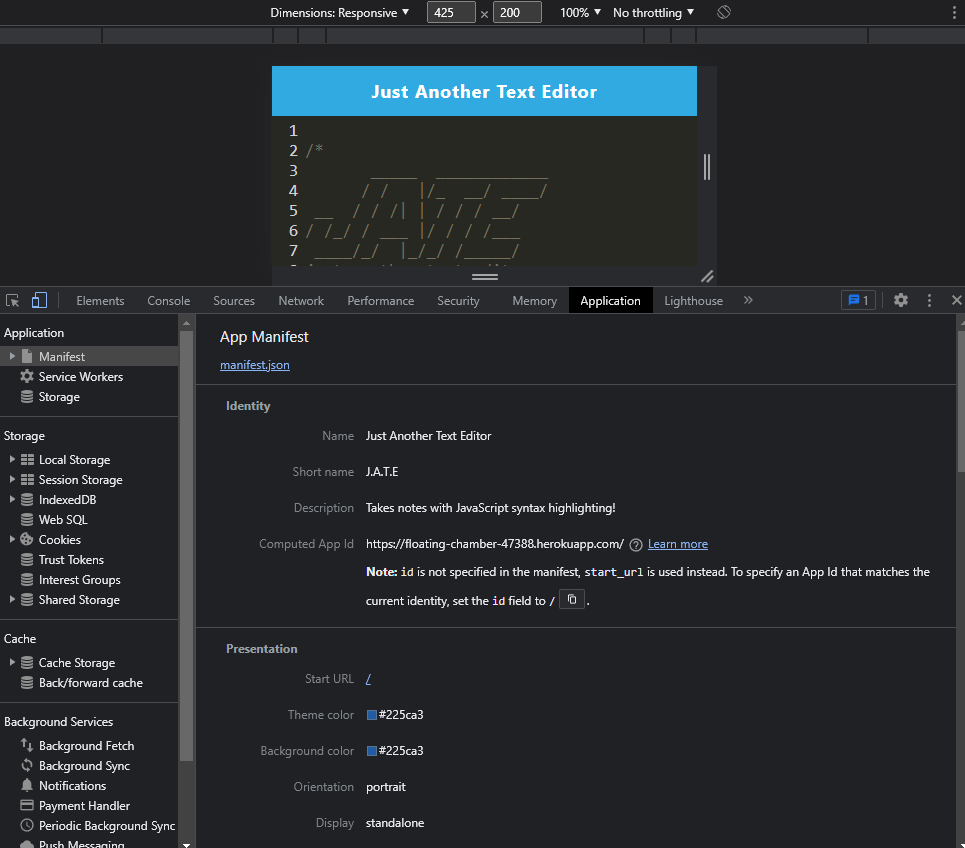
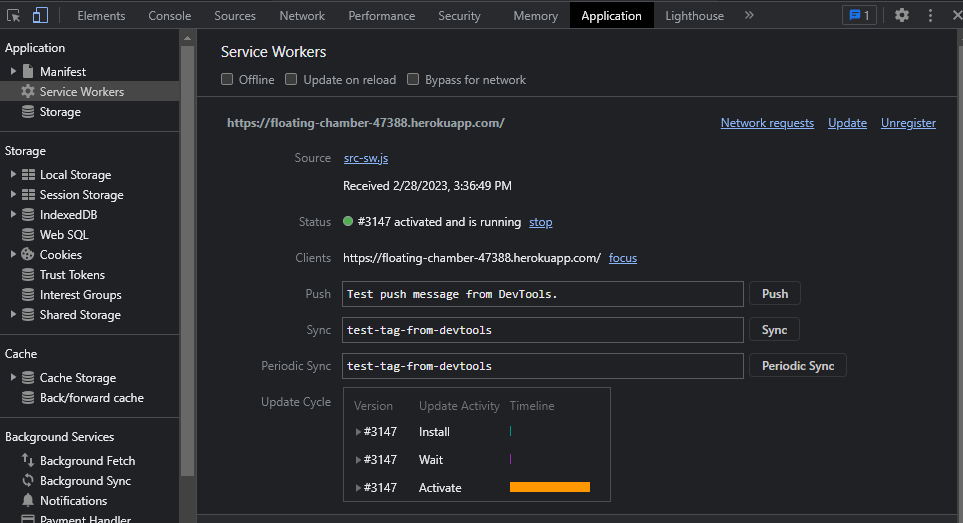
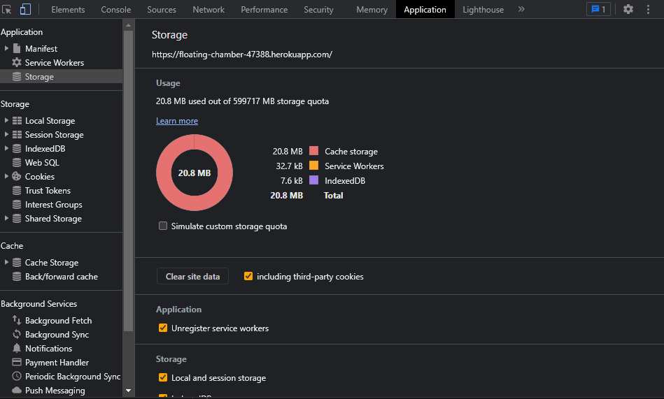

# text editor

## Description
using PWA and IndexedDB creates a text editor that can be installed and used offline.

## Table of Contents
* [Installation](#installation)
* [Usage](#usage) 
* [License](#license)
* [Contributing](#contributing)
* [Questions](#questions)

## Installation
To install necessary dependencies, run the following command in the terminal using node.js:
concurrently and nodemon is installed with npm install

## Usage 
Install dependencies and run the "build" script and "start:dev" to run and edit on your personal machine. \
See package.json for more options

## License
This project is licensed under the MIT license.

## Questions
Contact through email or Github

Email: zechariahbarrett@oultook.com

GitHub: [zecb7](https://github.com/zecb7) 

